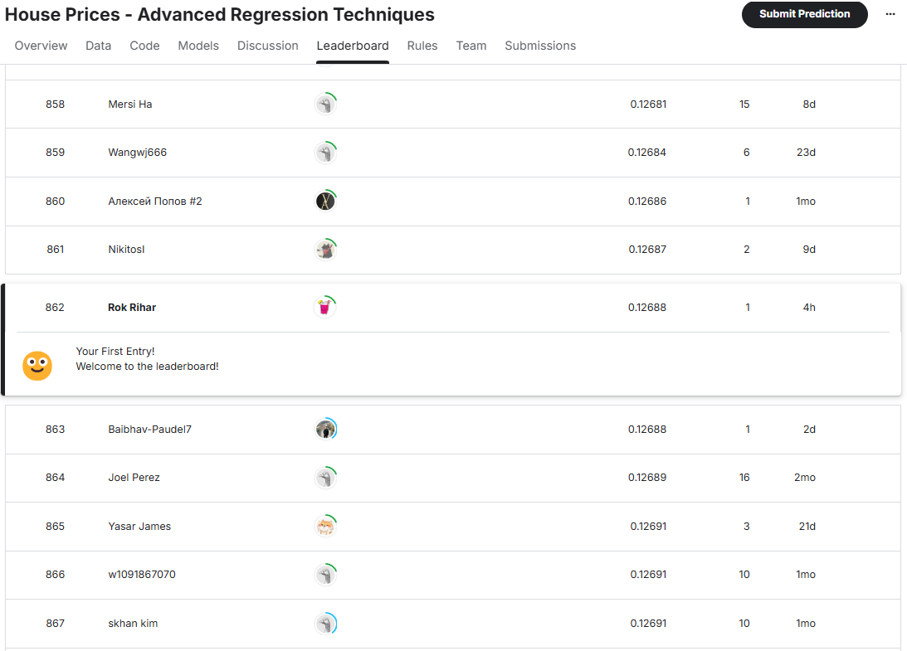

# Končno poročilo: Napovedovanje cen nepremičnin v Amesu s pomočjo naprednih regresijskih tehnik

## 1. Uvod

V tem končnem poročilu predstavljamo pregled projekta napovedovanja cen nepremičnin v mestu Ames, Iowa. Nadgradili smo analize in modele, predstavljene v vmesnem poročilu, z namenom razvitja natančnejšega napovednega sistema. Cilj projekta je bil raziskati podatkovni niz, implementirati napredne tehnike strojnega učenja, izvesti "feature engineering" ter na koncu ustvariti interaktivno spletno aplikacijo za praktično uporabo razvitega modela (streamlit).

Cene nepremičnin so odvisne od kombinacije dejavnikov, kot so število sob ali lokacija. V tem projektu smo analizirali nabor podatkov o približno 2900 stanovanjih v Amesu, ki vsebuje 79 opisnih spremenljivk – od dimenzij kleti do bližine železniških prog. Glavni izziv je bil identifikacija najpomembnejših dejavnikov, ki vplivajo na ceno in izbiro najbolj natančnega napovednega modela.

## 2. Vir in oblika podatkov

Podatki, uporabljeni v tem projektu so iz tekmovanja ["House Prices - Advanced Regression Techniques"](https://www.kaggle.com/competitions/home-data-for-ml-course) na platformu Kaggle. 

**Struktura podatkov:**
Podatki so razdeljeni na tri glavne datoteke:
* `train.csv`: Učni niz, ki vsebuje 1460 zapisov (hiš) in 81 stolpcev. Med temi stolpci je tudi naša ciljna spremenljivka `SalePrice` (prodajna cena).
* `test.csv`: Testni niz, ki vsebuje 1459 zapisov in 80 stolpcev. Ta niz ne vsebuje stolpca `SalePrice`, saj je naloga napovedati te vrednosti.
* `data_description.txt`: Podroben opis vsake od 79 značilk (spremenljivk), ki pojasnjuje pomen posameznega stolpca. Ta datoteka je ključna za razumevanje podatkov in informirano "feature engineering".
* `sample_submission.csv`: Primer datoteke za oddajo napovedi v pravilni obliki.

**Značilnosti podatkovnega niza:**
Podatki vključujejo:
* **Numerične spremenljivke:** npr. `LotArea` (velikost parcele), `YearBuilt` (leto izgradnje), `1stFlrSF` (kvadratura prvega nadstropja), `GrLivArea` (nadzemna bivalna površina).
* **Kategorikalne spremenljivke:** npr. `MSZoning` (splošna klasifikacija cone), `Neighborhood` (fizične lokacije znotraj meja mesta Ames), `RoofStyle` (tip strehe), `Condition1` (bližina različnih pomembnih točk, npr. ceste, železnice, `OverallQual` - splošna kvaliteta materiala in končne obdelave, ocenjena od 1 do 10).
* **Manjkajoče vrednosti:** Številni stolpci vsebujejo manjkajoče vrednosti (NaN). Najpogosteje se pojavljajo v stolpcih, kot so `PoolQC` (kvaliteta bazena), `MiscFeature` (razne dodatne značilnosti), `Alley` (tip dostopa do parcele), `Fence` (kvaliteta ograje), `FireplaceQu` (kvaliteta kamina).
* **Časovne spremenljivke:** kot so `YearBuilt` (leto izgradnje), `YearRemodAdd` (leto prenove), `GarageYrBlt` (leto izgradnje garaže) in `YrSold` (leto prodaje).

## 3. Eksplorativna analiza podatkov (EDA)

Preden smo se lotili izbire kompleksnih modelov, smo izvedli EDA, da bi bolje razumeli strukturo, porazdelitve in medsebojne odnose med spremenljivkami. Ta faza je bila ključna za odkrivanje vzorcev, identifikacijo osamelcev in o strategijah predprocesiranja.

**3.1. Analiza ciljne spremenljivke `SalePrice`**
Prvi korak je bil pregled naše ciljne spremenljivke, `SalePrice`.
* **Porazdelitev:** Ugotovili smo, da je porazdelitev prodajnih cen desno-asimetrična (pozitivno asimetrična). To pomeni, da je večina hiš prodanih po nižjih do srednjih cenah, medtem ko manjše število hiš dosega bistveno višje cene.
    * Za stabilizacijo variance in približevanje normalni porazdelitvi, kar je pogosto koristno za linearne modele in nekatere druge algoritme, smo uporabili logaritemsko transformacijo `SalePrice` (običajno `np.log1p` ali `np.log`).
* **Opisna statistika:** Povprečna cena hiše v učnem nizu je okoli $180,921.

**3.2. Numerične spremenljivke**
* **Korelacije:** Analizirali smo korelacijsko matriko med numeričnimi spremenljivkami in `SalePrice`. Najmočnejše pozitivne korelacije s `SalePrice` so pokazale:
    * `OverallQual` (Splošna kvaliteta materiala in končne obdelave)
    * `GrLivArea` (Nadzemna bivalna površina)
    * `GarageCars` (Velikost garaže glede na kapaciteto avtomobilov)
    * `GarageArea` (Velikost garaže v kvadratnih čevljih)
    * `TotalBsmtSF` (Skupna površina kleti)
    * `1stFlrSF` (Površina prvega nadstropja)
    * `FullBath` (Polne kopalnice nad zemljo)
    * `TotRmsAbvGrd` (Skupno število sob nad zemljo, brez kopalnic)
    * `YearBuilt` (Leto izgradnje)
    * `YearRemodAdd` (Leto prenove)

**3.3. Kategorikalne spremenljivke**
* **Vpliv na ceno:** Za kategorikalne spremenljivke smo analizirali, kako se povprečna `SalePrice` razlikuje med različnimi kategorijami (boxplot). Na primer:
    * `Neighborhood`: Cene so se močno razlikovale glede na sosesko, kar kaže na velik vpliv lokacije.
    * `MSZoning`: Različne cone so imele različne povprečne cene.
    * `HouseStyle`: Tip hiše (npr. enonadstropna, dvonadstropna) je vplivalo na ceno.
    Vizualizacije, kot so "box-ploti", so pomagale prikazati te razlike in identificirati kategorije, povezane z višjimi ali nižjimi cenami. Več informacij v VMESNO.md.

**3.4. Manjkajoče vrednosti**
Podrobno smo pregledali manjkajoče vrednosti. Za vsak stolpec z manjkajočimi podatki smo na podlagi `data_description.txt` ugotavljali, ali `NaN` pomeni dejansko odsotnost neke lastnosti (npr. `NaN` v `PoolQC` verjetno pomeni, da hiša nima bazena) ali pa gre za resnično manjkajoč podatek.

**3.5. Osamelci**
Identificirali smo potencialne osamelce, zlasti v odnosu med `GrLivArea` in `SalePrice`. Nekatere hiše z zelo veliko bivalno površino so imele relativno nizko ceno. Na podlagi analiz (in splošne prakse pri tem tekmovanju) smo se odločili za odstranitev nekaj izrazitih osamelcev iz učnega niza, saj bi lahko nesorazmerno vplivali na učni proces modela. Seznam indeksov odstranjenih osamelcev (npr. `[598, 955, ...]`) je bil uporabljen tudi v `streamlib_housing_prices.py` pri nalaganju podatkov.

## 4. Predprocesiranje podatkov in Feature Engineering

Ta faza je bila ena najpomembnejših v projektu, saj kakovost vhodnih podatkov neposredno vpliva na uspešnost modelov. 

**4.1. Obravnava manjkajočih vrednosti**
Strategija imputacije (menjava null vrednosti v nekaj kot No, NA, unf, 0...) je bila odvisna od tipa spremenljivke in pomena manjkajoče vrednosti:

**4.2. Transformacije spremenljivk**
* **Logaritemska transformacija `SalePrice`:** Kot omenjeno v EDA, smo `SalePrice` transformirali z `np.log` (ali `np.log1p`) za stabilizacijo variance. Vse napovedi modelov so bile posledično na logaritmirani skali, zato smo jih pred prikazom uporabniku transformirali nazaj z `np.exp` (ali `np.expm1`).

  

**4.3. Feature Engineering (Ustvarjanje novih značilk)**
Ustvarili smo več novih značilk, ki združujejo obstoječe ali iz njih izpeljujejo bolj smiselne informacije. Spodaj so podrobneje opisane nekatere izmed njih, skupaj z utemeljitvami.

* **`houseAge = YrSold - YearBuilt`**
    * *Zakaj?* Samo leto izgradnje (`YearBuilt`) pove, kdaj je bila hiša zgrajena, a modelu manjka kontekst, kako "stara" je hiša v času prodaje. Hiša, stara 100 let, je povsem drugačna od hiše, stare 5 let.
    * *Kaj zajame?* Razmerje med datumom prodaje in datumom izgradnje. Starejše hiše imajo običajno več obrabe, medtem ko novejše hiše pogosto dosegajo višjo ceno zaradi sodobnejše gradnje, manj potrebnih popravkov...

* **`houseRemodelAge = YrSold - YearRemodAdd`**
    * *Zakaj?* Hiša, ki je bila nedavno adaptirana ali obnovljena, je običajno vredna več kot tista, ki ni bila dolgo časa prenovljena. Samo leto zadnje adaptacije (`YearRemodAdd`) modelu ne pove, koliko časa je minilo od takrat do prodaje.
    * *Kaj zajame?* Časovno razliko med prodajo in zadnjo prenovo. Če ni bilo prenove, je `YearRemodAdd` enak `YearBuilt`, torej bo `houseRemodelAge` enak `houseAge`.

* **`IsNewHouse = (YearBuilt == YrSold).astype(int)`**
    * *Zakaj?* Popolnoma nove hiše (prodane v letu izgradnje) imajo lahko poseben premijski status na trgu.
    * *Kaj zajame?* Binarna značilka, ki označuje, ali je bila hiša prodana v istem letu, ko je bila zgrajena.

* **`TotalSF = GrLivArea + TotalBsmtSF`**
    * *Zakaj?* Skupna bivalna površina, vključno s kletjo, je močan indikator velikosti in posledično cene.
    * *Kaj zajame?* Celotno uporabno površino hiše.

* **`totalBaths = FullBath + 0.5 * HalfBath + BsmtFullBath + 0.5 * BsmtHalfBath`**
    * *Zakaj?* Število kopalnic je pomembno, vendar imajo polovične kopalnice manjšo vrednost kot polne. Ta formula to uteži.
    * *Kaj zajame?* Skupno "kopalniško kapaciteto" hiše.
... in še nekaj ostalih.

Nova korelacijska matrika:

**4.4. Kodiranje kategorikalnih spremenljivk**
Kategorikalne spremenljivke je treba pretvoriti v numerično obliko, da jih lahko modeli strojnega učenja uporabijo.
* **Ordinalno kodiranje:** Uporabljeno za spremenljivke, kjer obstaja naravna hierarhija med kategorijami (npr. `ExterQual`: Excellent > Good > Average > Fair > Poor). Kategorijam smo dodelili numerične vrednosti (npr. Ex=4, Gd=3, TA=2, Fa=1, NA=0).
* **"One-Hot" kodiranje:** Uporabljeno za nominalne kategorikalne spremenljivke, kjer ni vrstnega reda (npr. `Neighborhood`, `MSZoning`). Vsaka kategorija postane nov binarni stolpec (0 ali 1). To preprečuje, da bi model napačno interpretiral vrstni red med kategorijami. (handle_unknown='ignore')

**4.5. Skaliranje numeričnih spremenljivk**
Po imputaciji in "feature engineeringu" smo vse numerične spremenljivke skalirali s `StandardScaler`. Ta postopek transformira podatke tako, da imajo povprečje 0 in standardni odklon 1.

**4.6. Uporaba `Pipeline`**
Vse korake predprocesiranja (imputacija, kodiranje, skaliranje) smo združili v `ColumnTransformer` in nato v `Pipeline`. To zagotavlja, da se enaki koraki predprocesiranja uporabijo tako na učnih kot na testnih podatkih, kar preprečuje "data leakage".

## 5. Izbira modelov

Po skrbni pripravi podatkov smo prešli na fazo treniranja in ocenjevanja različnih modelov. Cilj je bil najti model, ki najbolje generalizira na podatke in doseže najnižjo napako napovedi (najnižji RMSE).

**5.1. Izhodiščni model (Baseline)**
Kot je bilo omenjeno v vmesnem poročilu, smo najprej zgradili preprost model `DecisionTreeRegressor` z uporabo le nekaj osnovnih značilk. Ta model je služil kot osnovna referenca za primerjavo z naprednejšimi pristopi.

**5.2. Izbor in trening naprednejših modelov**
Implementirali in preizkusili smo vrsto naprednejših regresijskih modelov:

* **Linearni modeli:**
    * `Linear Regression`
    * `Ridge Regression`.

* **Drevesni modeli:**
    * `RandomForestRegressor`
    * `GradientBoostingRegressor`
    * `XGBRegressor` (XGBoost)
    * `LGBMRegressor` (LightGBM)
    * `CatBoostRegressor`

**5.3. Ansambelske metode (Ensemble Methods)**
Za dodatno izboljšanje napovedi smo uporabili ansambelske tehnike, ki združujejo napovedi več osnovnih modelov:

* **`VotingRegressor`:**
    * Združuje napovedi več različnih modelov s povprečenjem.

* **`StackingRegressor` (Zlaganje modelov):**
    * **Nivo 0 (Base Learners):** Modeli kot XGBoost, LightGBM, CatBoost, Ridge.
    * **Nivo 1 (Meta-Learner):** `RidgeCV`.
    * Ta pristop se je izkazal za najuspešnejšega.

**5.4. Optimizacija hiperparametrov**
Za ključne modele so bili hiperparametri nastavljeni na podlagi predhodnih eksperimentov in dobrih praks.

## 6. Rezultati in diskusija

Po obsežnem predprocesiranju, "feature engineeringu" in treniranju različnih modelov smo dosegli izboljšanje napovedne natančnosti.

**6.1. Primerjava uspešnosti modelov**
Končni `StackingRegressor`, ki je združeval napovedi XGBoost, LightGBM, CatBoost in Ridge regresije z RidgeCV kot meta-modelom, je pokazal najboljše rezultate, dosegel RMSLE okoli 0.12. Datoteka `submission.csv` je bila generirana s tem modelom.

**6.2. Pomembnost značilk**
Analiza pomembnosti značilk (npr. iz `RandomForestRegressor`) je pokazala, da so najvplivnejše:
1.  `OverallQual`
2.  Novoustvarjene značilke: `TotalSF`, `houseAge`, `TotalBathrooms`
3.  `GrLivArea`
4.  `ExterQual`, `KitchenQual`
5.  Velikost garaže (`GarageCars`/`GarageArea`)
6.  `BsmtQual`
7.  `Neighborhood`

## 7. Streamlit spletna aplikacija

Da bi omogočili praktično uporabo in lažjo interakcijo z modelom, smo zgradili interaktivno spletno aplikacijo s pomočjo Streamlit.

**7.1. Namen in cilj aplikacije**
Glavni namen aplikacije je uporabnikom omogočiti:
1.  **Pridobivanje napovedanih cen za neko poljubno nepremičnino:** Uporabniki lahko vnesejo specifične značilnosti hiše in takoj prejmejo ocenjeno ceno take hiše.
2.  **Enostavna in intuitivna uporaba:** Zagotoviti vmesnik, ki ne zahteva predznanja s področja programiranja ali strojnega učenja.
3.  **Demonstracija modela:** Prikazati uporabnost razvitega napovednega sistema.

**7.2. Glavne funkcionalnosti aplikacije (`streamlib_housing_prices.py`)**

* **Nalaganje podatkov, predprocesiranje in treniranje modela (v ozadju ob prvem zagonu):**
    * Aplikacija pri prvem zagonu (ali ko se predpomnilnik osveži) izvede celoten postopek priprave modela.

* **Napovedovanje cene za vnesene značilke:**
    * Ko uporabnik vnese (ali spremeni) vrednosti značilk v stranski vrstici.

* **Prikaz rezultata:**
    * Ocenjena prodajna cena hiše se prikaže uporabniku na glavni strani aplikacije, znotraj sporočila o uspehu.

**7.3. Tehnološki sklop**
Za razvoj aplikacije so bile uporabljene naslednje ključne knjižnice in tehnologije:
* **Streamlit**
* **Pandas**
* **NumPy**
* **Scikit-learn**
* **XGBoost, CatBoost**

## 8. Zaključek

Projekt napovedovanja cen nepremičnin v Amesu je ponudil vpogled v celoten proces strojnega učenja, od razumevanja in priprave podatkov do gradnje kompleksnih modelov in njihove implementacije v uporabniku prijazno aplikacijo. Na tekmovanju Kaggle smo se uvrstili na 862/4784 mesto.

**Glavne ugotovitve:**
* **Kakovost podatkov je ključna**
* **"Feature engineering" prinaša veliko vrednost**
* **Napredni ansambelski modeli so zelo učinkoviti**
* **Praktična uporabnost:** Streamlit je pokazal, kako lahko napredne analitične modele približamo končnim uporabnikom in jim omogočimo praktično uporabo rezultatov.
