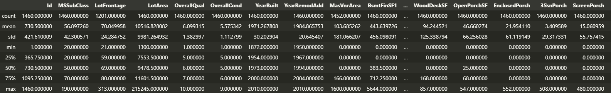
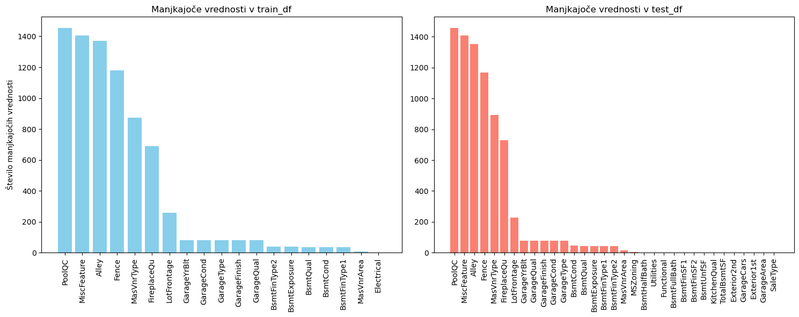
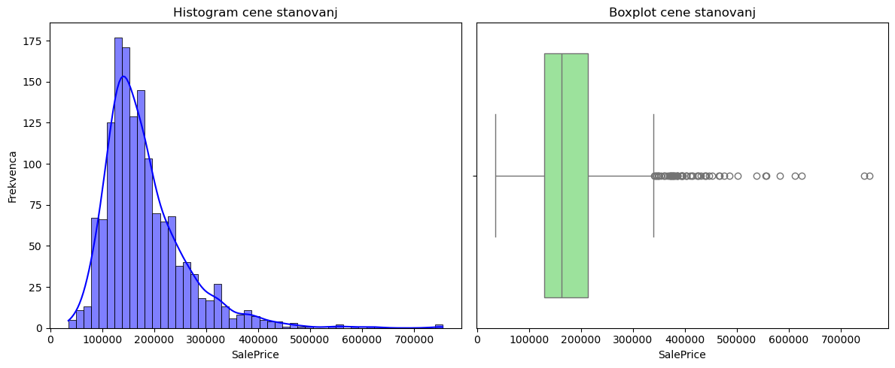
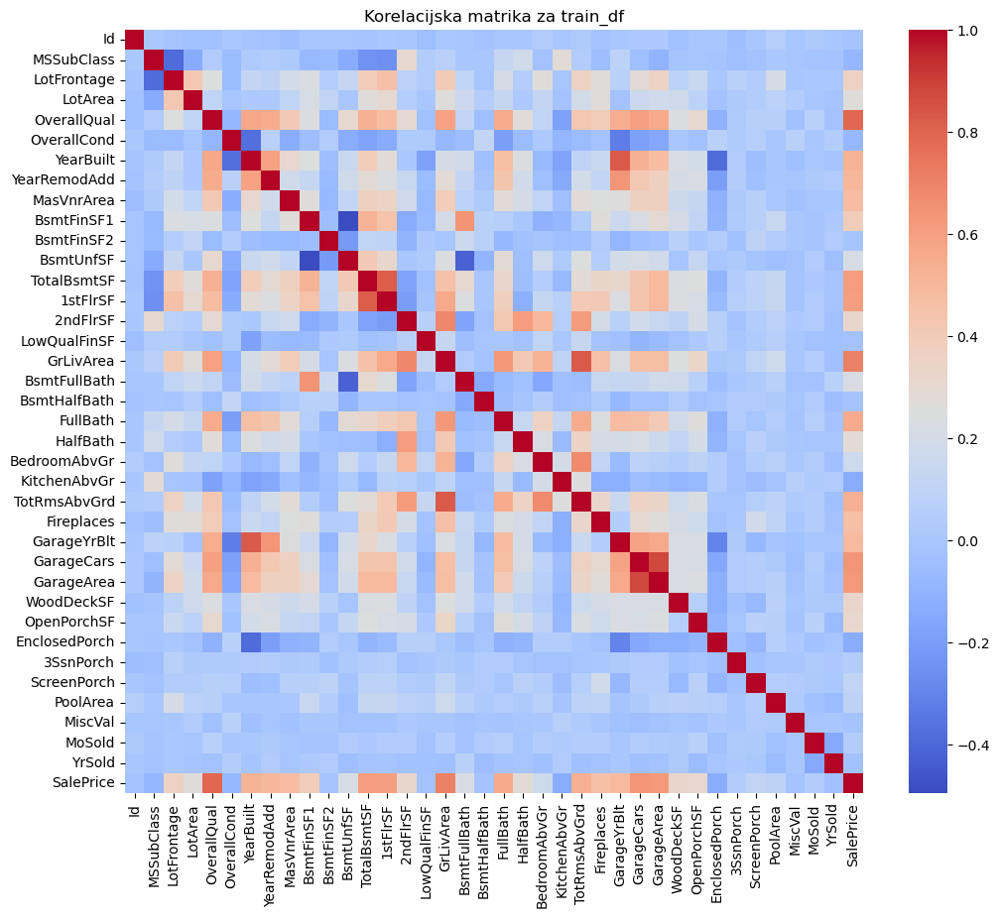
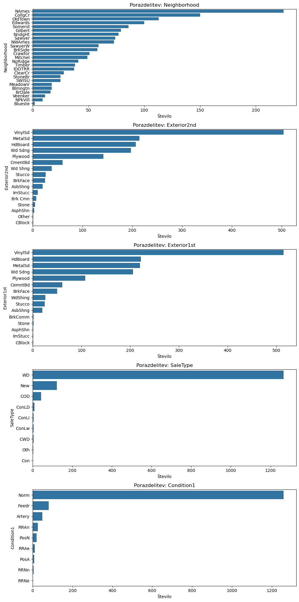
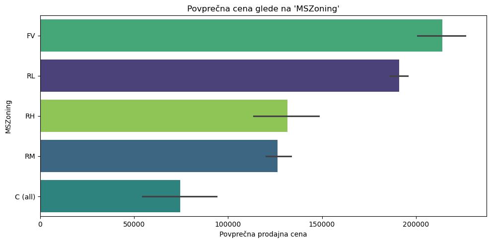
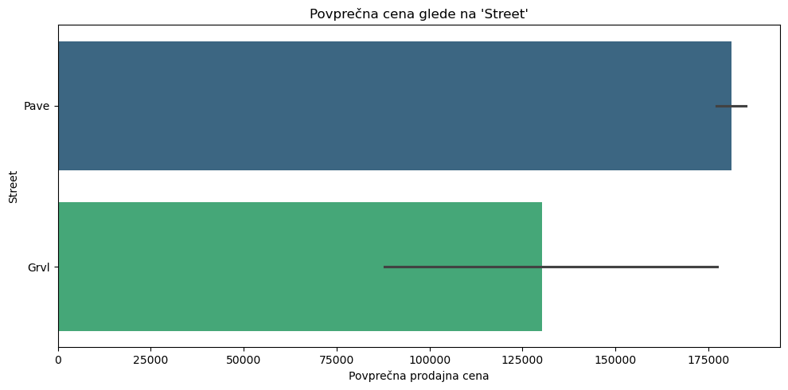
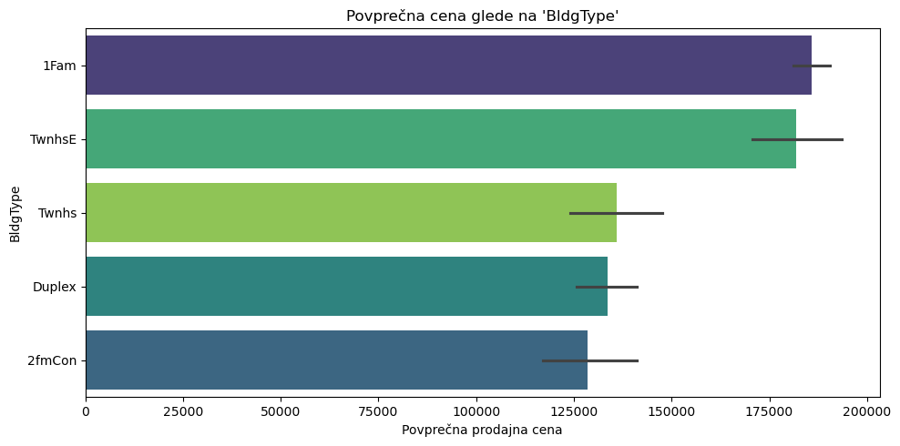
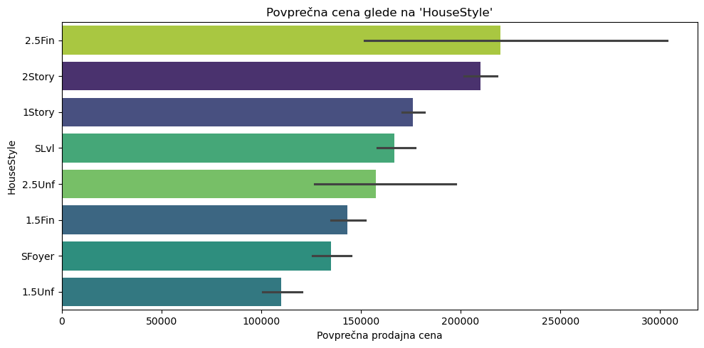
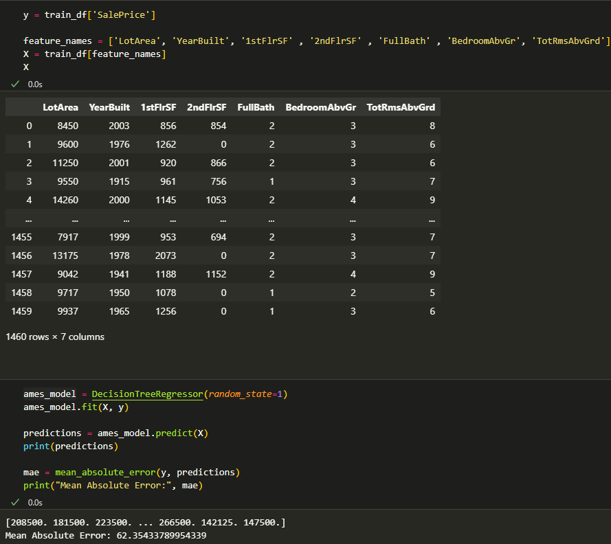

# VMESNO poročilo

## 1. Uvod

V tem vmesnem poročilu predstavljamo pregled problema, izvedenih analiz in glavnih rezultatov, pridobljenih s pomočjo analize podatkov iz domačega projekta in datoteke *Housing_prices_kaggle.ipynb*. Namen poročila je predstaviti problem ocenjevanja cen stanovanj in s tem pridobiti vpogled v dejavnike, ki vplivajo na ceno nepremičnine, vse to pa je v okviru dvojnem stron.

## 2. Opis problema

Cilj analize je napovedovanje cen stanovanj na podlagi različnih vhodnih spremenljivk (npr. kvadratura, leto gradnje, lokacija in druge značilne lastnosti). Problem je zastavljen kot regresijska naloga, kjer želimo razviti model, ki bo omogočal natančno določitev cene glede na podane parametre. 

## 3. Podatki

Uporabljeni podatki prihajajo iz poznanega Kaggle tekmovanja, ki se osredotoča na cene stanovanj. Imamo dva nabora podatkov test.csv in train.csv

Train.df je oblike (1460, 81) in test_df pa (1459,80), Train_df ima eno več za "SalePrice".

## 4. Izvedene analize in uporabljena orodja

V analizi smo izvedli:
- **Opisno statistiko:** Za vpogled v osnovne značilnosti podatkov, kot so povprečje, mediana in standardni odklon (samo za numerične spremenljivke).

- **Vizualizacije:**
* S tem delom kode smo pregledali in vizualno prikazali, kateri stolpci v train_df in test_df vsebujejo manjkajoče vrednosti ter koliko jih je. Vidimo, da so najbolj prazne PoolQC, MiscFeature, Alley, Fence, MasVnrType...

* Tukaj smo analizirali porazdelitev ciljnega atributa SalePrice. Histogram razkrije nesimetrično (desno pristransko) porazdelitev cen, kar potrjuje tudi boxplot z nekaj izrazitimi outlierji.
Ta ugotovitev pogosto vodi do uporabe log-transformacije, da podatke naredimo bolj normalno porazdeljene.

* Ta analiza nam pomaga razumeti, katere numerične spremenljivke so močno povezane z drugimi – še posebej pomembno je z SalePrice. Vidimo, da na ceno vplivajo najbolj: OverallQual (vse skupna kvaliteta), GrLivArea (stanovanjska površina nad nivojem tal),  GarageCars (velikost garaže glede na kapaciteto avtov),  FullBath (Popolne kopalnice v bivalnem delu hiše (nad tlemi)), MasVnrArea (površina opečne (ali kamnite) fasadne obloge), YearRemodAdd (datum prenove, enak datumu gradnje, če ni bilo prenove ali dozidave) ...

* V tem delu smo analizirali raznolikost kategorialnih spremenljivk. Izračunali smo, katere imajo največ unikatnih vrednosti in jih prikazali s stolpčnimi grafikoni. To pomaga odkriti morebitne dominantne kategorije ali neuravnotežene razrede.

* Ta analiza prikazuje, kako se povprečna prodajna cena (SalePrice) razlikuje med različnimi kategorijami izbranih kategoričnih spremenljivk (v našem primeru MSZoning, Street, BldgType, HouseStyle). To omogoča vpogled v to, katere kategorije so povezane z višjimi cenami in imajo morda večji napovedni potencial v modelih.

Kasneje bomo še objektnim spremenljivkam dodelili numerične vrednosti za ocene stanj kot .npr Ex=4, Gd=3,TA=2, Fa=1, NA=0. Izvedili bomo feature engineering kot (1stFlrSF + 2ndFlrSF = TotalSF).

- **Testni model:**
Ta del kode prikazuje zelo osnovno implementacijo modela `DecisionTreeRegressor` za napovedovanje cen nepremičnin. Uporabljene so bile osnovne značilnosti, kot so velikost parcele, leto gradnje, število sob itd., brez dodatne obdelave podatkov ali optimizacije modela. Čeprav je model preprost, lahko služi kot dobra izhodiščna točka za nadaljnje izboljšave kasneje.

## 5. Zaključek

V poročilu smo analizirali ključne značilnosti podatkov in njihov vpliv na ceno nepremičnin. Ugotovili smo pomembne povezave med spremenljivkami in izvedli osnovno testiranje modela. V nadaljevanju bomo nadgradili obdelavo in čiščenje podatkov ter preizkusili naprednejše modele za natančnejšo napoved cen.